  

  
  
  

---

## 🚀 A propos

Etudiant en 2e annee de BUT Informatique a l'IUT de Laval, je transforme des problemes complexes en applications utiles et ergonomiques. J'accorde une attention particuliere a l'architecture logicielle et a l'experience utilisateur (UI/UX). Mon approche est pragmatique : reflechir avant de coder pour livrer une solution propre, maintenable et evolutive.

**Ce qui me definit**
- 🧠 Rigueur : clean code et logique algorithmique
- 🎯 Sens du detail : maquettage avant developpement
- 📚 Apprentissage continu : chaque projet est une nouvelle opportunite

---

## 🛠️ Stack technique

  

- 💻 Langages : Java, Python, C
- 🌐 Web : HTML, CSS, JavaScript, PHP
- 🗄️ Bases de donnees : MySQL, MongoDB, SQL Server
- 🧰 Outils : Git, GitHub, IntelliJ IDEA, VS Code, Figma, Docker

---

## 📂 Projets

| Projet | Stack | Focus | 
| :--- | :--- | :--- |
| **Portfolio** | HTML, CSS, JS | Site vitrine personnel, animations, stats GitHub et WakaTime |
| **AppleBot** | Python, Discord.py | Bot Discord, gestion d'evenements asynchrones et logique serveur |
| **Tri Web** | PHP, SQL, JS | Application web full-stack, base de donnees relationnelle, MVC |
| **Morpion FX** | Java, JavaFX | Interface graphique et POO |
| **Meteo App** | JS, REST API | Consommation d'API et DOM en temps reel |

---

## 📊 Statistiques GitHub

  
  
  

 

  
  

 

  

 

  

---

  

    
  

  
<em>"Construire, comprendre, ameliorer - une ligne de code a la fois."</em>

---

  <picture>
    <source media="(prefers-color-scheme: dark)" srcset="https://raw.githubusercontent.com/TiboTsr/TiboTsr/output/github-contribution-grid-snake-dark.svg" />
    <source media="(prefers-color-scheme: light)" srcset="https://raw.githubusercontent.com/TiboTsr/TiboTsr/output/github-contribution-grid-snake.svg" />
    
  </picture>

