  
  

  

  
  
  

---

## 🚀 About

Second-year Computer Science student at IUT of Laval. I turn complex problems into useful, user-friendly applications, with a focus on software architecture and UI/UX. My approach is pragmatic: think before coding to deliver clean, maintainable, and scalable solutions.

**What defines me**
- 🧠 Rigor: clean code and solid algorithmic logic
- 🎯 Attention to detail: prototyping before development
- 📚 Continuous learning: every project is a new opportunity

---

## 🛠️ Tech stack

  

- 💻 Languages: Java, Python, C
- 🌐 Web: HTML, CSS, JavaScript, PHP
- 🗄️ Databases: MySQL, MongoDB, SQL Server
- 🧰 Tools: Git, GitHub, IntelliJ IDEA, VS Code, Figma, Docker

---

## 📂 Projects

| Project | Stack | Focus |
| :--- | :--- | :--- |
| **Portfolio** | HTML, CSS, JS | Personal showcase, animations, GitHub and WakaTime stats |
| **AppleBot** | Python, Discord.py | Discord bot, async events, server logic |
| **Tri Web** | PHP, SQL, JS | Full-stack web app, relational DB, MVC |
| **Morpion FX** | Java, JavaFX | Desktop UI and OOP |
| **Weather App** | JS, REST API | External APIs and real-time DOM updates |

---

## 📊 GitHub Stats

  
  
  

 

  
  

 

  

 

  

---

  

    
  

  
<em>"Build, understand, improve - one line of code at a time."</em>

---

  <picture>
    <source media="(prefers-color-scheme: dark)" srcset="https://raw.githubusercontent.com/TiboTsr/TiboTsr/output/github-contribution-grid-snake-dark.svg" />
    <source media="(prefers-color-scheme: light)" srcset="https://raw.githubusercontent.com/TiboTsr/TiboTsr/output/github-contribution-grid-snake.svg" />
    
  </picture>

